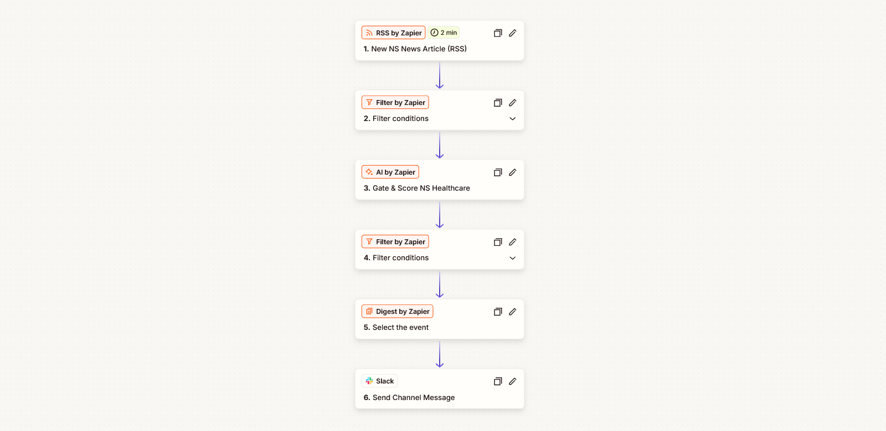

# Nova Scotia Healthcare Media Monitor

A no-code automation that watches Nova Scotia news feeds, uses AI to flag the stories about healthcare in the province, batches them through the day, and posts a single digest to Slack every morning.

Built with Zapier, RSS, an AI step, and Slack. No code, no scripting.



## Use this template

[Import this Zap on Zapier](https://zapier.com/templates/details/monitor-nova-scotia-healthcare-news-and-post-a-daily-slack-digest-302b01?secret=MTp0ZW1wbGF0ZTpxSEZ2TVBtSTQ1VFhESEVtUUdWekE1Y0pBSmF3cG9uNlRpdllxb0t0clZNOncxZ2hyZw)

Connect your own Slack account and edit the feed URLs, relevance threshold, digest time, and channel when prompted. The AI classification logic is locked.

## Why I built it

Healthcare coverage in Nova Scotia is spread across CBC, Global, and government press releases, and reading all of it every day is mostly noise. I wanted one morning digest that surfaces only the healthcare stories, scores how relevant each one is, and lands in a Slack channel, without standing up a paid media-monitoring tool.

## What it does

Through the day it:

1. Watches several Nova Scotia news feeds and picks up each new article.
2. Drops obvious non-health items with a free keyword filter before any paid step runs.
3. Sends the rest to an AI step that returns a category, a 0 to 100 relevance score, sentiment, key entities, and a one-sentence summary.
4. Keeps only articles where category is NS Healthcare and relevance is above 30.
5. Collects the matches and releases them as one Slack message at 7am Atlantic, then resets for the next day.

Example output:

```
Nova Scotia Healthcare: Daily Digest

- Halifax ER wait times hit a record amid staffing shortages  (Relevance 88/100, Negative)
A new report points to chronic understaffing across the central zone.
https://example.com/article-1

- Vaccine booking now available at 811  (Relevance 95/100, Positive)
Nova Scotians can now book vaccine appointments through the 811 service.
https://example.com/article-2
```

## How it works

| Stage | What happens |
|---|---|
| RSS trigger | Fires on each new article across the chosen feeds |
| Keyword filter | Free pre-filter that drops non-health items |
| AI gate + score | Classifies, scores relevance and sentiment, tags entities, summarizes |
| Relevance filter | Keeps articles where category is NS Healthcare and relevance is above 30 |
| Digest | Batches matches and releases once each morning at 7am |
| Slack | Posts the digest to a channel from bot "NS Health Monitor" |

The keyword filter is the cost control: the AI step only runs on the handful of articles that survive it, so a busy news day does not blow through task limits.

## Feeds

Defaults monitor:

- CBC Nova Scotia
- Global News Halifax
- Government of Nova Scotia, Health and Wellness news releases

Any RSS or Atom feed works. Swap in your own in the trigger.

## Setup

Full step-by-step is in [setup.md](setup.md). In short:

1. RSS by Zapier, New Items in Multiple Feeds, paste your feed URLs.
2. Filter by Zapier, keyword pre-filter.
3. AI by Zapier, paste the prompt and the five output fields from [ai-prompt.md](ai-prompt.md).
4. Filter by Zapier, category and relevance gate.
5. Digest by Zapier, daily release time.
6. Slack, Send Channel Message with the digest.

## Stack

- Zapier for scheduling, filtering, batching, and delivery
- RSS by Zapier for the feeds
- AI by Zapier for classification and scoring
- Slack for the daily delivery

## What is in this folder

| File | What it is |
|---|---|
| `README.md` | This overview |
| `ai-prompt.md` | The AI prompt and the five structured output fields |
| `setup.md` | Step-by-step Zap configuration |

---

All sample data is fictional. No real credentials, channels, or IDs are included.

Part of the [zapier-exekyute-templates](../) collection. MIT licensed.
