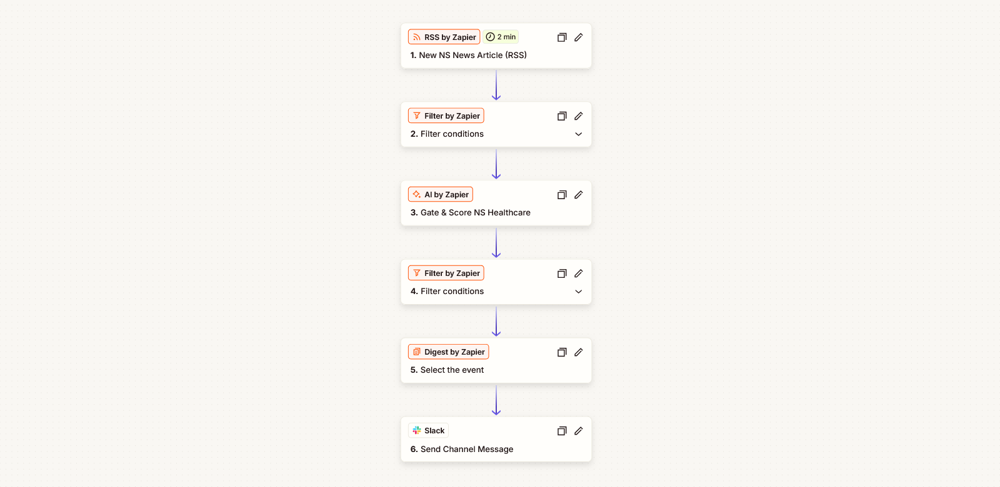

# Nova Scotia Healthcare Media Monitor

Watch several Nova Scotia news feeds, use an AI step to flag the stories about healthcare in the province, batch them through the day, and post a single digest to Slack every morning. A free keyword filter runs first and drops the obvious non-health items, so the paid AI step only sees the handful of articles that survive it.

Built with Zapier, plus RSS, an AI step, and Slack. No code, no scripting.



## Use this template

[Import this Zap on Zapier](https://zapier.com/templates/details/monitor-nova-scotia-healthcare-news-and-post-a-daily-slack-digest-302b01?secret=MTp0ZW1wbGF0ZTpxSEZ2TVBtSTQ1VFhESEVtUUdWekE1Y0pBSmF3cG9uNlRpdllxb0t0clZNOncxZ2hyZw)

Connect your own Slack account and edit the feed URLs, relevance threshold, digest time, and channel when prompted. The AI classification logic is locked.

## Use it when

- Healthcare coverage in Nova Scotia is spread across CBC, Global, and government press releases, and reading all of it every day is mostly noise.
- You want only the healthcare stories, each scored for relevance, landing in one Slack channel each morning.
- You would rather not stand up a paid media-monitoring service for a single beat in a single province.

## How it works

An RSS trigger fires on each new article across the chosen feeds, a free keyword filter drops the obvious non-health items, and the AI step classifies, scores, and summarizes what is left. A second filter keeps only NS Healthcare articles scoring above 30, a Digest step collects the matches through the day, and Slack posts them as one message each morning.

| Stage | What happens |
|---|---|
| RSS trigger | Fires on each new article across the chosen feeds |
| Keyword filter | Free pre-filter that drops non-health items |
| AI gate + score | Classifies, scores relevance and sentiment, tags entities, summarizes |
| Relevance filter | Keeps articles where category is NS Healthcare and relevance is above 30 |
| Digest | Batches matches and releases once each morning at 7am |
| Slack | Posts the digest to a channel from bot "NS Health Monitor" |

The keyword filter is the cost control: the AI step only runs on the handful of articles that survive it, so a busy news day does not blow through task limits.

Example output:

```
Nova Scotia Healthcare: Daily Digest

- Halifax ER wait times hit a record amid staffing shortages  (Relevance 88/100, Negative)
A new report points to chronic understaffing across the central zone.
https://example.com/article-1

- Vaccine booking now available at 811  (Relevance 95/100, Positive)
Nova Scotians can now book vaccine appointments through the 811 service.
https://example.com/article-2
```

## Requirements

- A Zapier account with RSS by Zapier, Filter, AI by Zapier, and Digest by Zapier.
- A Slack workspace and a channel for the digest.
- The RSS or Atom feed URLs you want to watch. Defaults are provided.

## Setup

Full step-by-step is in [setup.md](setup.md). In short:

1. RSS by Zapier, New Items in Multiple Feeds, paste your feed URLs.
2. Filter by Zapier, keyword pre-filter.
3. AI by Zapier, paste the prompt and the five output fields from [ai-prompt.md](ai-prompt.md).
4. Filter by Zapier, category and relevance gate.
5. Digest by Zapier, daily release time.
6. Slack, Send Channel Message with the digest.

## Feeds

Defaults monitor CBC Nova Scotia, Global News Halifax, and the Government of Nova Scotia Health and Wellness news releases. Any RSS or Atom feed works; swap in your own in the trigger.

## Customize

- Feeds: replace the default CBC, Global, and government feeds with any RSS or Atom URLs in the trigger.
- Threshold: the gate keeps articles scoring above 30; raise or lower it in the second filter.
- Digest time: change the 7am Atlantic release in the Digest step.
- Beat: to track a different topic, edit the prompt and the five output fields in `ai-prompt.md` and rebuild from the folder rather than the guided import.

## What is in this folder

| File | What it is |
|---|---|
| `README.md` | This overview |
| `ai-prompt.md` | The AI prompt and the five structured output fields |
| `setup.md` | Step-by-step Zap configuration |
| `images/` | The Zap canvas |

---

All sample data is fictional. No real credentials, channels, or IDs are included.

Part of the [zapier-exekyute-templates](../README.md) collection. MIT licensed.
