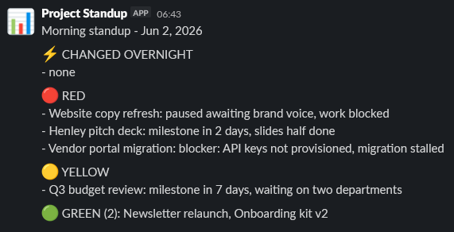
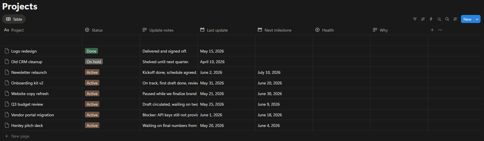

# Project Health Roll-up

A no-code automation that reads my active projects from Notion every weekday morning, uses AI to score each one Green / Yellow / Red, highlights what changed since yesterday, and sends a standup to Slack.

Built with Zapier, Notion, an AI step, and Slack. No code, no scripting.



## Why I built it

Project status usually lives scattered across notes and deadlines, and nobody re-reads it. I wanted one glanceable message each morning that tells me where to look first, and more importantly what moved overnight, without me opening anything.

## What it does

Every weekday morning at 7:30 AM it:

1. Pulls all Active projects from a Notion database.
2. Sends them to an AI step that scores each project's health and writes a short, blunt reason.
3. Compares today's scores against yesterday's and surfaces any changes at the top.
4. Sends the standup as a direct message in Slack.

Example output:

```
Morning standup - Jun 2, 2026

CHANGED OVERNIGHT
- Vendor portal migration: Red -> Green (blocker cleared)
- Onboarding kit v2: Green -> Red (milestone in 2 days)

RED
- Henley pitch deck: milestone in 2 days, slides half done
- Onboarding kit v2: milestone in 2 days, reviewer out

YELLOW
- Q3 budget review: milestone within a week, awaiting replies

GREEN (2): Vendor portal migration, Newsletter relaunch
```

## How it works


| Stage | What happens |
|---|---|
| Schedule | Fires every weekday at 7:30 AM |
| Read memory | Loads yesterday's standup from storage |
| Pull data | Queries Notion via API Request (Beta) for all Active projects |
| Score + compare | AI rates each project and diffs against yesterday |
| Notify | Sends the standup as a Slack direct message from bot "Project Standup" |
| Save memory | Stores today's standup for tomorrow's comparison |

The read-memory and save-memory stages are what let the standup lead with what changed overnight. A plain scheduled automation has no sense of yesterday; this one does.

## The data model



A single Notion database drives everything. Upkeep is about two minutes a week: jot a short progress note, set a date, and the automation handles the rest.

| Field | Purpose |
|---|---|
| Project | Name |
| Status | Active / On hold / Done (only Active is scored) |
| Update notes | Short progress note the AI reads |
| Last update | Staleness signal |
| Next milestone | Urgency signal |
| Health | Optional, for manual or formula-based color in Notion |
| Why | Optional notes field |

Notion is read-only in this build: the automation reads project fields and posts the result to Slack. It does not write back.

## Scoring logic

- Red: milestone within 3 days and not on track, a named blocker, or no update in over 14 days.
- Yellow: no update in 7 to 14 days, or a milestone within a week with unclear progress.
- Green: recent update and no near-term risk.

The exact wording lives in [ai-prompt.md](ai-prompt.md).

## Stack

- Zapier for the scheduling, data, storage, and Slack delivery
- Notion as the project database
- AI step for scoring and the change comparison
- Slack for the daily delivery

## What is in this folder

| File | What it is |
|---|---|
| `README.md` | This overview |
| `ai-prompt.md` | The AI scoring and change-detection prompt |
| `projects-day1.csv` | Sample data, ready to import into Notion |
| `synthetic-data.md` | Notes on the fictional sample dataset |

---

All sample data is fictional. No real project names, credentials, or IDs are included.

Part of the [zapier-exekyute-templates](../) collection. MIT licensed.
