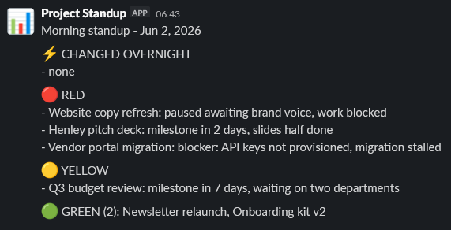
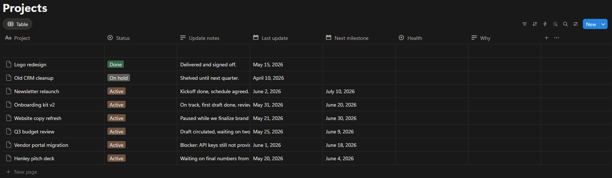

# Project Health Roll-up

Read every active project from a Notion database each weekday morning, score each one Green, Yellow, or Red with an AI step, and post one Slack standup that leads with what changed overnight. The Zap keeps yesterday's standup in Zapier Storage and diffs against it, so the message opens with the projects that moved rather than a flat list.

Built with Zapier, plus Notion, an AI step, and Slack. No code, no scripting.

## Use it when

- Project status is scattered across notes and deadlines and nobody re-reads it, so the things that slipped overnight are what you find out about last.
- You want one glanceable message each morning that says where to look first, without opening a dashboard or a dozen project pages.
- You already keep projects in Notion and can spend about two minutes a week jotting a progress note and a next-milestone date.

## How it works

A weekday schedule fires, a Storage step loads yesterday's standup, and an API Request pulls every Active project from Notion. The AI step scores each project and diffs the colors against yesterday, a Slack step delivers the standup as a direct message, and a final Storage step saves today's standup for tomorrow's comparison.

| Stage | What happens |
|---|---|
| Schedule | Fires every weekday at 7:30 AM |
| Read memory | Loads yesterday's standup from Storage |
| Pull data | Queries Notion via API Request (Beta) for all Active projects |
| Score + compare | AI rates each project and diffs against yesterday |
| Notify | Sends the standup as a Slack direct message from bot "Project Standup" |
| Save memory | Stores today's standup for tomorrow's comparison |

The read-memory and save-memory steps are what let the standup lead with what changed overnight. A plain scheduled automation has no sense of yesterday; this one does. The hero screenshot above shows a full standup: a changed-overnight block, then the red, yellow, and green groups.

## Requirements

- A Zapier account. Storage by Zapier holds the day-to-day memory and runs on the free plan.
- A Notion account with a projects database. Import `projects-day1.csv` to start with the sample set.
- An AI step (AI by Zapier) for the scoring and the change comparison.
- A Slack workspace for the daily standup.

## Setup

1. Schedule by Zapier: every weekday at 7:30 AM.
2. Storage by Zapier (Get): load the saved standup under a constant key. The first run returns FIRST RUN.
3. Notion via API Request (Beta): query the database for projects where Status is Active.
4. AI by Zapier: paste the prompt from [ai-prompt.md](ai-prompt.md) and map its three values (today's date, yesterday's standup, the Notion response).
5. Slack: send the AI output as a direct message from bot "Project Standup".
6. Storage by Zapier (Set): save today's standup under the same key for tomorrow.

## The data model

A single Notion database drives everything. Upkeep is about two minutes a week: jot a short progress note, set a date, and the automation handles the rest.

| Field | Purpose |
|---|---|
| Project | Name |
| Status | Active, On hold, or Done (only Active is scored) |
| Update notes | Short progress note the AI reads |
| Last update | Staleness signal |
| Next milestone | Urgency signal |
| Health | Optional, for manual or formula-based color in Notion |
| Why | Optional notes field |

Notion is read-only in this build. The automation reads project fields and posts the result to Slack; it does not write back.

## Scoring logic

- Red: milestone within 3 days and not on track, a named blocker, or no update in over 14 days.
- Yellow: no update in 7 to 14 days, or a milestone within a week with unclear progress.
- Green: recent update and no near-term risk.

The exact wording lives in [ai-prompt.md](ai-prompt.md).

## Customize

- Cadence: change the 7:30 AM weekday trigger to any schedule you want.
- Thresholds: the day counts and milestone windows live in `ai-prompt.md`; edit them there.
- Delivery: swap the Slack direct message for a channel post, or rename the bot.
- Fields: the AI reads Update notes, Last update, and Next milestone. Add or rename fields in both Notion and the prompt together.

## What is in this folder

| File | What it is |
|---|---|
| `README.md` | This overview |
| `ai-prompt.md` | The AI scoring and change-detection prompt |
| `projects-day1.csv` | Sample data, ready to import into Notion |
| `synthetic-data.md` | Notes on the fictional sample dataset |

---

All sample data is fictional. No real project names, credentials, or IDs are included.

Part of the [zapier-exekyute-templates](../README.md) collection. MIT licensed.
